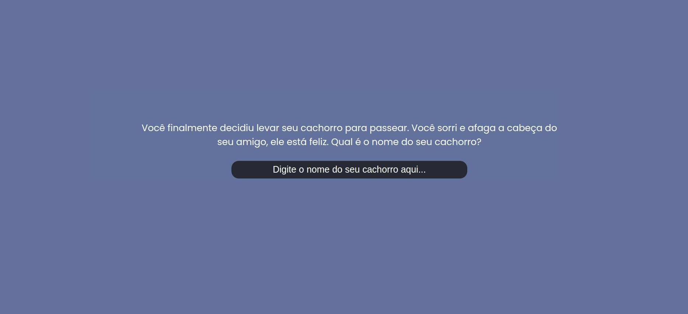

<h1 align="center">
    Text Game
</h1>

    
    
    
    

 

    

 

## Technologies and requirements
- HTML
- CSS
- JavaScript

## Project
This is a repository that contains a text game made it with JavaScript, only for studying DOM manipulation and the language itself.

## Run
Open the `index.html` with VSCode LiveServer.

## Status
In progress 🚧

## License
This project is under the MIT License. See [LICENSE](/LICENSE.md) file for more details.