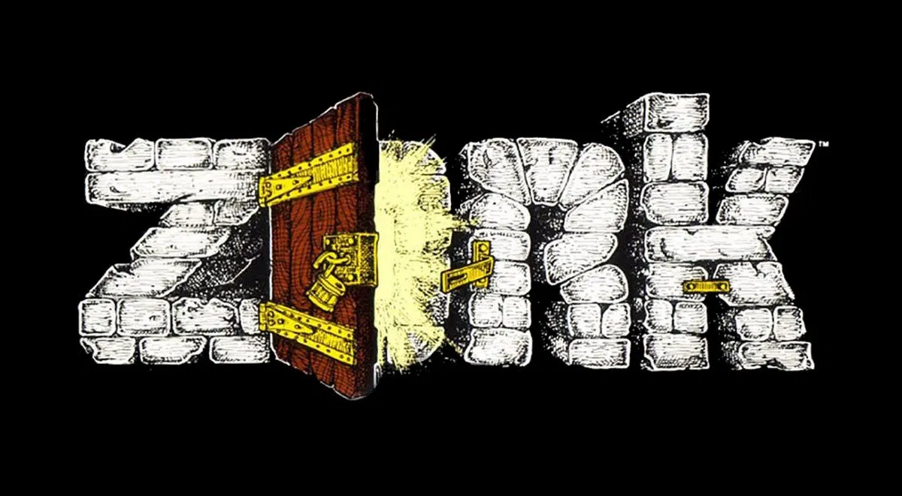

<h1 align="center">
    Text game
</h1>

    
    
    
    

 

    

 

## Technologies and requirements
- Java 11

## Project
This is just a text game like Zork for studying Java.

## Run
Download and run the .jar file.

## Status
In Progress 🚧

## License
This project is under the MIT License. See [LICENSE](/LICENSE.md) file for more details.